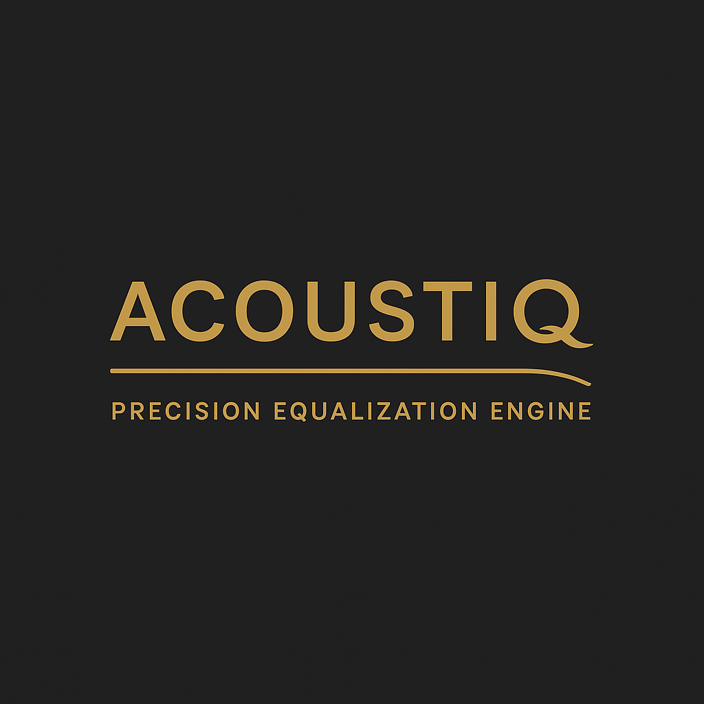
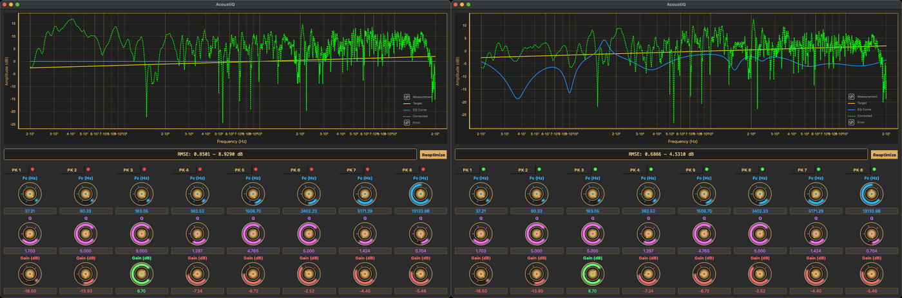

**Professional IIR parametric EQ optimizer for acoustic frequency response correction**

AcoustiQ fits N peaking filters (plus optional low/high-shelf filters) to match a measured frequency response to a target curve using nonlinear least squares optimization. The tool provides both static Plotly visualizations and an interactive PyQt6 interface with real-time knob adjustments for fine-tuning.




---

## Why Energy Domain Optimization?

**TL;DR: Use raw, unsmoothed measurement data. AcoustiQ will handle it.**

Traditional EQ optimizers work in the **logarithmic dB domain**, which sounds intuitive but has a critical flaw: they treat small and large errors with equal perceptual weight. A 3 dB error at -40 dB and a 3 dB error at 0 dB both contribute equally to the cost function, even though the latter represents a **10,000 × larger energy difference**. This forces users to heavily smooth their measurements to avoid fitting noise, which discards valuable information about the true acoustic response.

AcoustiQ optimizes in the **energy domain** (magnitude squared), where errors are weighted by their actual physical impact:

| Domain | Error Metric | Physical Meaning | Smoothing Required |
|--------|--------------|------------------|-------------------|
| **dB (log)** | `(20log₁₀\|H\| - target_dB)²` | Logarithmic deviation | **Heavy smoothing needed** (1/12 oct or more) |
| **Energy (linear)** | `(\|H\|² - target_linear²)²` | Actual acoustic energy error | **Raw data works great** |

### Practical Impact

**With dB domain optimizers:**
- ❌ Must smooth measurements heavily (lose fine detail)
- ❌ Fits noise peaks equally as real resonances
- ❌ Poor performance on raw room/headphone measurements
- ❌ Optimizes for what "looks good" on a log plot, not what sounds correct

**With AcoustiQ's energy domain:**
- ✅ Use raw, unsmoothed measurements directly
- ✅ Automatically prioritizes large deviations (where they matter most)
- ✅ Robust to measurement noise without preprocessing
- ✅ Optimizes for perceptually accurate correction

**Bottom line:** If your current workflow involves 1/3 octave smoothing or heavy preprocessing, try feeding AcoustiQ your raw measurement data instead. You'll likely get better results.

---

## Features

- **Energy Domain Optimization**: Perceptually accurate results with raw, unsmoothed data
- **Intelligent Filter Fitting**: Fits peaking, low-shelf, and high-shelf IIR biquad filters to correction curves
- **Interactive GUI**: Professional mixer-style knobs with real-time EQ adjustment (PyQt6)
- **Filter Management**: Toggle filters on/off, adjust parameters with visual feedback
- **Adaptive Bounds**: Automatic gain bounds based on target curve characteristics
- **Reoptimization**: Refine filters from GUI state with one-click reoptimization
- **Anchor Point**: Optional normalization at reference frequency (default: 1 kHz)
- **Target Tilt**: Apply frequency-dependent tilt to target curves
- **Multiple Output Formats**: Text filter parameters + corrected measurement CSV
- **Visualization**: Plotly plots showing measurement, target, EQ curve, corrected response, and error

---

## Installation

### Requirements

```bash
pip install numpy pandas scipy plotly pyqt6 pyqtgraph
```

### Dependencies

- Python 3.8+
- NumPy: Array operations
- Pandas: CSV I/O
- SciPy: Nonlinear optimization
- Plotly: Interactive plotting
- PyQt6: GUI framework
- PyQtGraph: Real-time plot updates

---

## Quick Start

### Basic Usage

Fit 5 peaking filters to match a measurement to a target:

```bash
# Use your RAW measurement - no smoothing needed with energy domain optimization!
python acoustiq.py -s measurement.csv -t target.csv -p 5
```

### With High-Shelf Filter

Add a high-shelf at 8 kHz:

```bash
python acoustiq.py -s measurement.csv -t target.csv -p 5 -hs 8000
```

### Interactive Mode

Launch the GUI for real-time adjustments:

```bash
python acoustiq.py -s measurement.csv -t target.csv -p 7 -i
```

### Complete Example

Full-featured optimization with shelves, custom bounds, and output:

```bash
python acoustiq.py \
  -s measurement.csv \
  -t target.csv \
  -p 7 \
  -ls 100 \
  -hs 8000 \
  -fbp "50,5000" \
  -fbs "6000,12000" \
  -o fitted_filters.txt \
  -co corrected_measurement.csv \
  -i
```

---

## Command-Line Arguments

### Required Arguments

| Argument | Description |
|----------|-------------|
| `-s, --source` | Source measurement CSV file (frequency, dB) |
| `-t, --target` | Target response CSV file (frequency, dB) |

### Filter Configuration

| Argument | Default | Description |
|----------|---------|-------------|
| `-p, --n-peaks` | 9 | Number of peaking filters |
| `-hs, --high-shelf` | None | High-shelf center frequency (Hz) |
| `-ls, --low-shelf` | None | Low-shelf center frequency (Hz) |
| `-sdo, --shelf-drift-oct` | 0.3 | Allowed octave drift for shelf filters |

### Frequency Bounds

| Argument | Description |
|----------|-------------|
| `-fb, --fc-bounds` | Global frequency bounds for all filters (e.g., '30,16000') |
| `-fbp, --fc-bounds-peaks` | Frequency bounds for peaking filters (e.g., '20,1000') |
| `-fbs, --fc-bounds-shelf` | Frequency bounds for high-shelf (e.g., '3000,20000') |
| `-flb, --fc-bounds-low-shelf` | Frequency bounds for low-shelf (e.g., '100,800') |

### Parameter Bounds

| Argument | Default | Description |
|----------|---------|-------------|
| `-qb, --Q-bounds` | (0.1, 10.0) | Q bounds for peaking filters |
| `-sqb, --shelf-q-bounds` | (0.01, 1.0) | Q bounds for shelf filters |
| `-gb, --gain-bounds` | Adaptive | Gain bounds in dB (auto-calculated from target) |

### Optimization Settings

| Argument | Default | Description |
|----------|---------|-------------|
| `-m, --maxiter` | 100000 | Maximum optimizer iterations |
| `-g, --freq-grid-points` | 2048 | Number of frequency grid points |
| `-r, --fs` | 48000.0 | Sampling rate (Hz) |
| `-rf, --ref-hz` | 1000.0 | Reference frequency for normalization |
| `-n1, --no-anchor1k` | False | Disable anchor constraint at reference frequency |
| `-aw, --anchor-weight` | 50.0 | Anchor constraint weight |

### Input/Output

| Argument | Default | Description |
|----------|---------|-------------|
| `-o, --output` | fitted_filters.txt | Output filter parameters file |
| `-co, --corrected-output` | None | Output corrected measurement CSV |
| `-fi, --filter-input` | None | Input filter file for initial parameters |
| `-f, --freqs` | None | Custom frequency grid (comma-separated) |

### Visualization

| Argument | Description |
|----------|-------------|
| `-i, --interactive` | Enable interactive PyQt6 GUI |
| `-np, --no-plot` | Disable all visualization |

### Advanced

| Argument | Default | Description |
|----------|---------|-------------|
| `-tl, --tilt` | 0.0 | Apply tilt (dB/octave) to target relative to ref_hz |
| `-sw, --shelf-weight` | 1.0 | Weight multiplier for shelf region |

---

## Input File Format

CSV files must contain two columns: **frequency** (Hz) and **amplitude** (dB).

### Example: `measurement.csv`

```csv
frequency,raw
20,45.2
25,46.8
31.5,48.1
...
16000,52.3
20000,50.1
```

### Example: `target.csv`

```csv
frequency,raw
20,50.0
25,50.0
31.5,50.0
...
16000,50.0
20000,50.0
```

---

## Output Format

### Filter Parameters File

Text file with filter specifications in parametric EQ format:

```
# Target: target.csv
# Source: measurement.csv
# RMS_error_linear: 0.0234
# RMS_error_dB: 0.85
Preamp: -6.2 dB
Filter 1: ON LS Fc 120.45 Hz Gain -2.34 dB Q 0.450
Filter 2: ON PK Fc 215.67 Hz Gain 3.21 dB Q 1.234
Filter 3: ON PK Fc 487.23 Hz Gain -4.56 dB Q 2.150
...
Filter 9: ON HS Fc 8234.12 Hz Gain 5.67 dB Q 0.650
```

### Corrected Measurement CSV

CSV with corrected frequency response (measurement + EQ):

```csv
frequency,raw
20,49.8
25,50.1
31.5,49.9
...
```

---

## Interactive GUI

### Features

- **Professional Knobs**: Analog mixer-style controls with glowing arcs
- **Real-Time Updates**: Instant plot updates as you adjust parameters
- **Filter Toggle**: Click filter labels to enable/disable (green/red LED indicators)
- **Editable Fields**: QLineEdit boxes below each knob for precise entry (press Enter to apply)
- **Parameter Labels**: Color-coded labels (Fc: cyan, Q: purple, Gain: green/red)
- **Reoptimize Button**: Re-run optimization using current GUI state as initial guess
- **RMSE Display**: Live error metrics in both linear and dB domains

### Keyboard Shortcuts

- **Enter**: Apply QLineEdit value and update plot
- **Tab**: Navigate between parameter fields
- **Mouse Wheel**: Fine-tune knob values (when focused)

### GUI Workflow

1. Run script with `-i` flag to launch GUI
2. Adjust filters manually using knobs or text fields
3. Toggle filters on/off to test combinations
4. Click "Reoptimize" to refine current configuration
5. Close window to save best parameters to output file

---

## Algorithm Details

### Energy Domain Optimization (The Secret Sauce)

Most EQ optimizers minimize error in dB: `minimize Σ(H_dB - target_dB)²`

This is **mathematically convenient but perceptually wrong**. Consider:

- A –40 dB SPL tone boosted by 3 dB → –37 dB SPL
- A 0 dB SPL tone boosted by 3 dB → +3 dB SPL

Both are simple +3 dB errors in the log domain (treated identically by dB-domain optimizers),  
yet the **absolute acoustic energy error** at the louder frequency is **10,000 × larger**.  
That is the core flaw that energy-domain optimization fixes.

AcoustiQ optimizes in **energy domain**: `minimize Σ(|H|² - target_linear²)²`

This naturally weights large peaks/dips more heavily than small ripples, matching human perception and avoiding the need for artificial smoothing. The optimizer automatically focuses on the problems that actually matter to your ears.

### Why This Matters for Real Measurements

Room and headphone measurements contain:
1. **Large modal/resonance peaks** (5-15 dB) ← Must be corrected
2. **Small ripples from reflections** (±1-2 dB) ← Should be ignored

- **dB domain:** Both contribute similarly → optimizer wastes filters on noise → must smooth data first
- **Energy domain:** Large peaks dominate cost function → optimizer ignores small ripples naturally → raw data is fine

### Optimization Method

- **Domain**: Energy (magnitude squared) for perceptually accurate results
- **Loss Function**: Soft L1 (Huber loss) for robustness to outliers
- **Solver**: Trust Region Reflective (TRF) with 3-point Jacobian
- **Convergence**: xtol, ftol, gtol = 1e-9 for high precision

### Biquad Filters

All filters use RBJ (Robert Bristow-Johnson) cookbook formulas:

- **Peaking**: Parametric bell filter
- **High-Shelf**: Treble boost/cut above corner frequency
- **Low-Shelf**: Bass boost/cut below corner frequency

### Frequency Response Computation

Pre-computes complex frequency vectors `z = exp(-j*2*pi*f/fs)` once per grid for efficiency. Filter response is evaluated as:

```
H(z) = (b0 + b1*z^-1 + b2*z^-2) / (1 + a1*z^-1 + a2*z^-2)
```

### Weighting Strategy

- Pure energy-domain loss (|H|² − target²)²
- Soft-L1 (Huber) loss → large deviations dominate automatically
- Broadband errors (shelves, overall tilt) naturally receive higher effective weight
- Very light Gaussian smoothing (~3 % of points) only for numerical stability

---

## Examples

### Headphone EQ Correction

```bash
# Correct HD650 to Harman target with 7 peaks + high-shelf
# NOTE: Use your RAW measurement data - no smoothing needed!
python acoustiq.py \
  -s HD650_measurement_raw.csv \
  -t Harman_2018.csv \
  -p 7 \
  -hs 9000 \
  -o HD650_Harman.txt \
  -i
```

### Speaker Room Correction

```bash
# Correct room response with bass shelf + peaks
# Works great with raw REW measurements - smoothing not required
python acoustiq.py \
  -s room_measurement_raw.csv \
  -t target_flat.csv \
  -p 9 \
  -ls 80 \
  -fbp "80,8000" \
  -o room_correction.txt \
  -co room_corrected.csv
```

### Starting from Existing Filters

```bash
# Refine previous optimization result
python acoustiq.py \
  -s measurement.csv \
  -t target.csv \
  -fi previous_filters.txt \
  -i
```

### Custom Tilt Target

```bash
# Apply -1 dB/octave tilt (darker sound)
python acoustiq.py \
  -s measurement.csv \
  -t neutral.csv \
  -p 5 \
  -tl -1.0 \
  -rf 1000
```

---

## Troubleshooting

### "Should I smooth my measurement data first?"

**No.** This is the whole point of energy domain optimization. If you're coming from tools like REW, AutoEQ or other dB-domain optimizers, you're probably used to applying 1/6 or 1/3 octave smoothing. **Don't do that with AcoustiQ.** Feed it raw data and let the energy domain weighting handle noise rejection naturally.

**Comparison:**
- **Your old workflow:** Measure → Smooth to 1/3 octave → Optimize in dB domain
- **AcoustiQ workflow:** Measure → Optimize in energy domain (done!)

The smoothing step isn't just unnecessary—it's counterproductive. It discards real resonance information that AcoustiQ can correct.

---

## Performance Tips

1. **Reduce Grid Points**: Use `-g 1024` for faster optimization (default: 2048)
2. **Limit Iterations**: Set `-m 2000` for quick initial fits
3. **Narrow Bounds**: Constrain frequency ranges to relevant audio bands
4. **Disable Plotting**: Use `-np` for batch processing

---

## Citation

If you use AcoustiQ in your research or projects, please cite:

```bibtex
@software{AcoustiQ,
  title={AcoustiQ: IIR Parametric EQ Optimizer},
  author={MrChillStorm},
  year={2025},
  url={https://github.com/MrChillStorm/AcoustiQ}
}
```

---

## License

MIT License - see LICENSE file for details

---

## Acknowledgments

- RBJ Audio EQ Cookbook for biquad formulas
- SciPy optimization team
- PyQt6 and PyQtGraph developers

---

## Contact

- Issues: [GitHub Issues](https://github.com/MrChillStorm/AcoustiQ/issues)

---

**Happy EQ'ing! 🎧**
